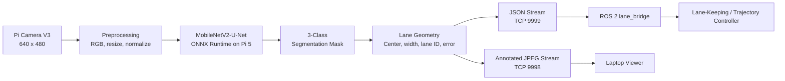

# Lane Detection and Lane Keeping Perception

Camera-based lane perception for the **MASAR autonomous vehicle**, running on a Raspberry Pi 5 with a Raspberry Pi Camera Module V3.

The subsystem uses a **MobileNetV2-U-Net semantic-segmentation model** exported to ONNX to detect the track markings, estimate the active lane and lane center, calculate lateral error, assign a confidence value, and stream the results to the ROS 2 control stack.

> This module is responsible for perception only. It does not command the motors directly. The trajectory controller consumes its lane measurements and generates the vehicle motion commands.

## System Overview



### End-to-End Processing Sequence

1. Capture a `640 x 480` frame using Pi Camera V3.
2. Convert the frame to RGB.
3. Resize it to the model input size, `320 x 240`.
4. Normalize pixel values to `[0, 1]` and convert from HWC to CHW format.
5. Run one ONNX inference pass.
6. Apply `argmax` across the model classes to obtain a class-index mask.
7. Process the bottom 80% of the mask as the region of interest.
8. Extract solid-boundary and lane-separator pixels.
9. Estimate the active lane, lane width, and lane center.
10. Calculate signed error in pixels and an approximate lane-aware error in centimeters.
11. Assign a confidence value based on the available visual evidence.
12. Send lane data to the ROS 2 bridge and stream an annotated frame to the viewer.

## Model

### Architecture

- **Task:** Semantic segmentation
- **Encoder:** MobileNetV2 with transfer learning
- **Decoder:** U-Net-style upsampling path
- **Deployment format:** ONNX
- **Runtime:** ONNX Runtime on Raspberry Pi 5 CPU
- **Input:** `1 x 3 x 240 x 320` RGB tensor
- **Output:** Per-class score map converted to a mask using `argmax`

MobileNetV2-U-Net was selected as a practical compromise between pixel-level segmentation quality and the computational limits of real-time Raspberry Pi deployment.

### Segmentation Classes

| Class ID | Class | Meaning |
|---:|---|---|
| `0` | Background | All pixels that are not lane markings |
| `1` | Solid boundary | Solid white track boundary |
| `2` | Lane separator | Dashed separator between the inner and outer lanes |

### Custom Dataset

A project-specific dataset was collected because public road datasets do not match the indoor RC-car environment. The final dataset includes:

- Inner- and outer-lane views
- Straight sections and curves
- Centered and laterally shifted vehicle positions
- Partial line visibility
- Imperfect driving cases
- The real camera mounting height, tilt, lighting, reflections, and track geometry

Images were labeled with **LabelMe** and converted from annotation JSON files into class-index masks for training.

## Lane Geometry and Error Calculation

### Region of Interest

The geometry stage uses the bottom 80% of the predicted mask:

```text
roi_top = int(0.20 * image_height)
ROI = mask[roi_top:image_height, 0:image_width]
```

The upper part of the image contains distant markings that are more affected by perspective and contribute less reliable information for immediate vehicle control.

### Lane Center

When both markings are valid, the lane center is the midpoint between the solid boundary and separator:

```text
lane_center_x = (solid_x + separator_x) / 2
```

When only one marking is visible, the center is reconstructed using lane-aware geometry, remembered lane width, or the learned offset associated with the cleaner visible line.

### Error Convention

```text
image_center_x = image_width / 2
error_px = lane_center_x - image_center_x
```

- `error_px > 0`: the estimated lane center is to the right of the image center.
- `error_px < 0`: the estimated lane center is to the left of the image center.

The pixel error is the primary perception measurement passed to the controller.

### Pixel-to-Centimeter Calibration

The centimeter value is an auxiliary, lane-aware estimate:

```text
error_calibrated_px = error_px - lane_offset_px
error_cm = error_calibrated_px / pixels_per_cm
```

Documented calibration values:

| Constant | Value |
|---|---:|
| Physical lane width | `36.7 cm` |
| Outer-lane zero offset | `-8.5 px` |
| Inner-lane zero offset | `-7.5 px` |
| Outer-lane scale | `2.19 px/cm` |
| Inner-lane scale | `2.51 px/cm` |

The centimeter estimate is most reliable on straight sections. In curves, perspective and vehicle-heading error affect the image measurement, so `error_cm` should be treated as approximate.

## Confidence Logic

| Visual evidence | Estimation method | Confidence |
|---|---|---:|
| Solid boundary and separator visible | Midpoint of both markings | `1.0` |
| Solid boundary only | Single-line reconstruction | `0.5` |
| Separator only | Single-line reconstruction | `0.4` |
| No marking, previous center available | Low-confidence fallback | `0.2` |
| No usable estimate | Image-center fallback | `0.0` |

Confidence allows the controller to reduce trust in ambiguous measurements instead of treating every frame as equally reliable.

## Output Data

The lane stream sends JSON data through TCP port `9999`. The exact payload can evolve with the runtime script, but the principal fields are:

| Field | Description |
|---|---|
| `lane` | Current lane: `inner`, `outer`, or `unknown` |
| `center` | Estimated lane center in model-image coordinates |
| `error` | Signed lateral error in pixels |
| `error_cm` | Approximate calibrated lateral error in centimeters |
| `confidence` | Reliability of the current estimate |
| `width` | Remembered lane width in pixels |
| `curvature` | Diagnostic separator-slope/curvature estimate |
| `solid_count` / `sep_count` | Number of detected pixels for each lane class |
| `solid_x` / `sep_x` | Representative positions of the detected markings |

The ROS 2 bridge converts the TCP data into lane topics used by the trajectory controller. Confirm the final topic names from `ros2_ws/src/lane_bridge/`.

## Runtime Communication

| Port | Data | Consumer |
|---:|---|---|
| `9999` | JSON lane geometry and diagnostics | ROS 2 bridge / trajectory controller |
| `9998` | Annotated JPEG frames | Laptop viewer |

Only one model inference is performed per camera frame. The same inference result is reused for the JSON output and visual stream to reduce Raspberry Pi CPU load.

## Files

- `lane_model.onnx` and `lane_model_onnx.data` - trained three-class segmentation model
- `lane_stream_final.py` - Pi camera capture, ONNX inference, geometry extraction, JSON server, and annotated-video server
- `lane_viewer.py` - laptop viewer for the annotated JPEG stream (`Q` to quit, `F` for fullscreen)
- `ros2_ws/src/lane_bridge/` - ROS 2 bridge from the Pi JSON stream to lane topics
- `Lane_Detection_Lane_Keeping_Chapter__3_.docx` - complete lane-detection and lane-keeping documentation
- `Lane_Detection_Challenges_Report.docx` - development challenges, diagnoses, and mitigation history

## Engineering Challenges and Final Mitigations

The largest errors occurred in curves, where perspective distortion, partial visibility, and segmentation ambiguity affected the geometric post-processing.

| Challenge | Root cause | Mitigation |
|---|---|---|
| Wrong solid-only fallback direction | The same `-lane_width/2` sign was used for both lanes | Use lane-aware signs for inner and outer lanes |
| Corner bias from full-ROI averaging | Far-ahead curved pixels shifted the arithmetic mean | Use a near-car median from the lowest valid rows |
| Two-wall contamination | Both solid walls could be classified as one class when the separator disappeared | Select the cluster nearest the previous trusted anchor |
| Large separator blob in the inner lane | The curved separator could be over-segmented into a wide region | Learn line-to-center offsets from clean frames and prefer the cleaner line |
| Polynomial-fit overshoot | A straight fit extrapolated below the available curved pixels | Avoid extrapolation; estimate only from observed near-car pixels |
| Anchor snowballing | A bad frame could corrupt the next frame's filter anchor | Save anchors before update and hard-update only from clean frames |
| Frozen output during contaminated frames | Holding the last clean result made the measurement unresponsive | Keep a live output and limit only the maximum per-frame jump |

These measures reduced isolated spikes and improved robustness, but they did not completely eliminate systematic curve error.

## Known Limitations

- Curves remain less accurate than straight sections because the separator may become a wide curved blob or leave the field of view.
- The system relies on one forward-facing camera, so single-line fallback is sometimes unavoidable.
- The observed processing rate is approximately `5-6 FPS`; at vehicle speed, this introduces measurable perception delay.
- The camera position and tilt must remain fixed after training and calibration.
- Strong glare and reflections from the indoor track can affect segmentation.
- The trained model is specialized for the project track and lighting distribution.
- The centimeter error is an approximate interpretation, not a complete ground-plane localization estimate.

## Future Improvements

- Add inverse perspective mapping / bird's-eye-view calibration.
- Apply camera undistortion using measured camera calibration parameters.
- Retrain with additional inner-lane corner, glare, blur, and partial-visibility examples.
- Replace single-position extraction with row-wise or polynomial lane modeling that does not extrapolate beyond observed pixels.
- Fuse camera measurements with wheel odometry or IMU data using a state estimator such as an Extended Kalman Filter.
- Increase inference frame rate through model optimization or hardware acceleration.
- Add physical-plausibility checks for impossible changes in lane width or error.

## Deploying the Model to the Raspberry Pi

Replace `<PI_IP>` with the current Raspberry Pi address.

```bash
scp lane_model.onnx pi@<PI_IP>:/home/pi/
scp lane_model_onnx.data pi@<PI_IP>:/home/pi/
```

Install the required runtime packages inside the environment used by the lane script:

```bash
pip install --upgrade onnxruntime numpy
```

### Verify That the Model Loads

```bash
python3 - <<'PY'
import numpy as np
import onnxruntime as ort

session = ort.InferenceSession(
    "/home/pi/lane_model.onnx",
    providers=["CPUExecutionProvider"],
)
input_name = session.get_inputs()[0].name
dummy = np.random.rand(1, 3, 240, 320).astype(np.float32)
output = session.run(None, {input_name: dummy})
print("Output shape:", output[0].shape)
print("Model loaded successfully")
PY
```

### Benchmark Inference

```bash
python3 - <<'PY'
import time
import numpy as np
import onnxruntime as ort

session = ort.InferenceSession(
    "/home/pi/lane_model.onnx",
    providers=["CPUExecutionProvider"],
)
input_name = session.get_inputs()[0].name
dummy = np.random.rand(1, 3, 240, 320).astype(np.float32)

for _ in range(5):
    session.run(None, {input_name: dummy})

samples = []
for _ in range(30):
    start = time.perf_counter()
    session.run(None, {input_name: dummy})
    samples.append(time.perf_counter() - start)

mean_time = float(np.mean(samples))
print(f"Mean inference: {mean_time * 1000:.1f} ms")
print(f"Inference FPS: {1.0 / mean_time:.1f}")
PY
```

## Running the Subsystem

### Raspberry Pi

```bash
source ~/lane_env/bin/activate
python3 lane_stream_final.py
```

### Laptop Viewer

```bash
python3 lane_viewer.py
```

### ROS 2 Bridge

```bash
source /opt/ros/humble/setup.bash
source ~/ros2_ws/install/setup.bash
ros2 run lane_bridge lane_bridge_node
```

## Documentation

For the full training methodology, equations, calibration, validation, curve analysis, and development history, see:

- `Lane_Detection_Lane_Keeping_Chapter__3_.docx`
- `Lane_Detection_Challenges_Report.docx`
